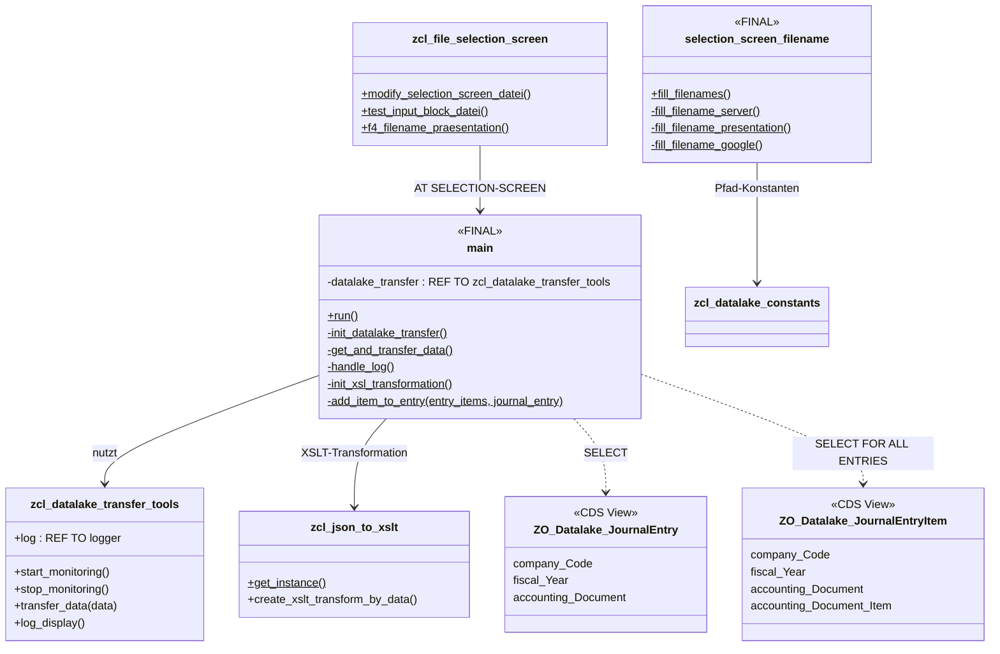
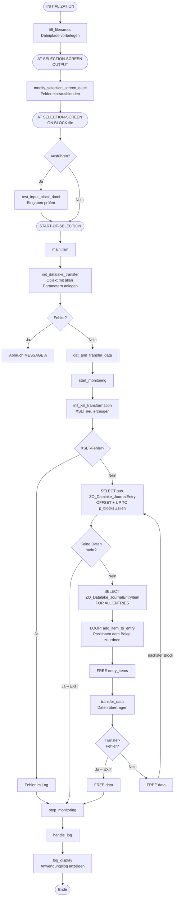
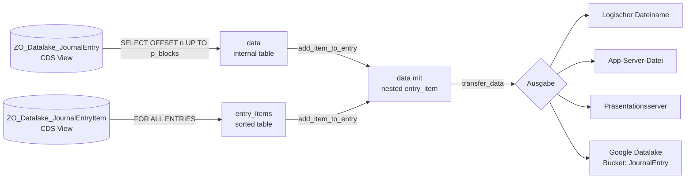

# ZDATALAKE_JOURNALENTRY – Diagramme

Report: Übertragung der Buchhaltungsbelege (BKPF + BSEG) an den Datalake  
Autor: Ralf Joswig, 17.08.2026

---

## Klassendiagramm

---

## Ablaufdiagramm

---

## Datenfluss: Blockweise Verarbeitung

