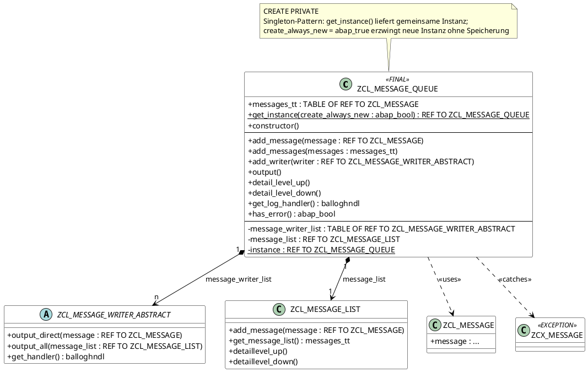

```markdown
---
id: d3aee96d-de6d-4f9e-b004-64b07bf44a4e
type: program
subtype: class
title: "ZCL_MESSAGE_QUEUE – Nachrichtenqueue mit Writer-Framework (Singleton)"
object: ZCL_MESSAGE_QUEUE
source: inbox/processed/ZCL_MESSAGE_QUEUE.abap
created: 2026-08-06
author: OI-JOSWIGR
---

## Zweck
Verwaltet eine interne Queue von Nachrichten (`ZCL_MESSAGE`) und leitet diese synchron an beliebig viele registrierte Writer (`ZCL_MESSAGE_WRITER_ABSTRACT`) weiter; stellt sich dabei als Singleton bereit.

## Öffentliche Schnittstelle

### Methoden

| Methode | Signatur (kurz) | Beschreibung |
|---------|----------------|-------------|
| `get_instance` | `CLASS-METHODS IMPORTING create_always_new TYPE abap_bool DEFAULT abap_false RETURNING result TYPE REF TO zcl_message_queue` | Gibt die Singleton-Instanz zurück; bei `create_always_new = abap_true` wird stets eine neue Instanz erzeugt |
| `constructor` | — | Initialisiert die interne Nachrichtenliste (`ZCL_MESSAGE_LIST`) |
| `add_message` | `IMPORTING message TYPE REF TO zcl_message` | Fügt eine einzelne Nachricht zur Queue hinzu und ruft sofort `output_direct` auf allen registrierten Writern auf |
| `add_messages` | `IMPORTING messages TYPE messages_tt` | Fügt mehrere Nachrichten sequenziell über `add_message` hinzu |
| `add_writer` | `IMPORTING writer TYPE REF TO zcl_message_writer_abstract` | Registriert einen Writer für direkte und gesammelte Ausgabe |
| `output` | — | Übergibt die gesamte Nachrichtenliste via `output_all` an alle registrierten Writer |
| `detail_level_up` | — | Erhöht den Detaillevel der internen Nachrichtenliste |
| `detail_level_down` | — | Senkt den Detaillevel der internen Nachrichtenliste |
| `get_log_handler` | `RETURNING result TYPE balloghndl` | Gibt den BAL-Log-Handle des ersten Writers zurück, der einen gesetzt hat |
| `has_error` | `RETURNING result TYPE abap_bool` | Prüft, ob mindestens eine Nachricht mit Typ `error`, `abort` oder `exit` in der Queue vorhanden ist |

## Ausgabe / Wirkung
- Hält intern eine Liste aller hinzugefügten Nachrichten (`ZCL_MESSAGE_LIST`)
- Bei `add_message`: sofortige Weiterleitung jeder Nachricht an alle Writer per `output_direct`
- Bei `output`: Aufruf von `output_all` auf jedem registrierten Writer mit der vollständigen Nachrichtenliste
- `has_error` liefert `abap_true`, sobald eine Nachricht vom Typ `error`, `abort` oder `exit` enthalten ist
- `get_log_handler` gibt den `balloghndl` des ersten Writers zurück, der einen gültigen Handle besitzt

## Grober Ablauf
1. Instanz über `get_instance` beziehen (Singleton oder neue Instanz bei `create_always_new = abap_true`)
2. Writer über `add_writer` registrieren
3. Nachrichten über `add_message` / `add_messages` zur Queue hinzufügen; jede Nachricht wird sofort per `output_direct` an alle Writer weitergegeben
4. Optional: Detaillevel der Ausgabe über `detail_level_up` / `detail_level_down` steuern
5. Gesammelte Ausgabe über `output` abschließend an alle Writer übergeben
6. Fehler-Status über `has_error` prüfen

## Abhängigkeiten
- `ZCL_MESSAGE` — Nachrichtenobjekt (ein Eintrag in der Queue)
- `ZCL_MESSAGE_LIST` — Interne Nachrichtenliste mit Detaillevel-Steuerung
- `ZCL_MESSAGE_WRITER_ABSTRACT` — Abstrakte Basisklasse für alle Writer (direkte und gesammelte Ausgabe)
- `ZCX_MESSAGE` — Ausnahmeklasse, die bei Writer-Ausgaben abgefangen wird
- `ZENUM_MESSAGE_TYPE` — Enum mit Nachrichtentypen (`error`, `abort`, `exit`) für `has_error`
- Typ `BALLOGHNDL` (SAP Business Application Log Handle) für `get_log_handler`

## Besonderheiten
[Bitte ergänzen, falls relevant]
```

## Klassendiagramm


